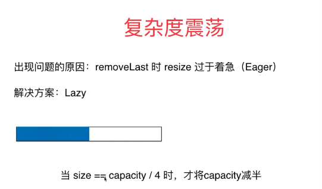

## 简单的时间复杂度分析
- O(1) O(n) O(lgn) O(nlogn) O(n^2)
- 大O描述的是算法的运行时间和输入数据之间的guanxi
```java
public static int sum(int[] nums){
    int sum = 0;
    for(int num:nums) sum+=num;
    return sum;
}

O(n) n 是nums中的元素个数
```
- 为何用大O ,叫做O(n)? 忽略常数，实际实际 T= c1*n +c2
- T = 2*n +2     O(n)
- T = 2000*n + 10000 O(n)      渐进时间复杂度
- T = 1*n*n + 0    O(n^2)      描述n趋近于无穷的情况
- T =2*n*n +300n + 10 O(n^2)
### 分析动态数组的时间复杂度
- 添加操作
  - addLast(e)        &nbsp;&nbsp;&nbsp;  O(1)
  - addFirst(e)       &nbsp;&nbsp;&nbsp;  O(n)  &nbsp; &nbsp; O(n)
  - add(index,e)      &nbsp;&nbsp;&nbsp;  O(n/2)   
  - resize 操作 ，需要把元素都复制一遍 O(n)
严格计算需要一些概率论知识
- 删除操作 O(n)
  - removeLast(e)  O(1)
  - removeFirst(e) O(n)    O(n)  resize O(n)
  - remove(index,e) O(n/2)=O(n)
- 修改操作
  - set(e)  O(1)
- 查找操作
  - get(index) O(1)
  - contains(e) O(n)
  - find(e)    O(n)  

- 增：O(n)
- 删: O(n)
- 改: 已知索引O(1); 未知索引 O(n)
- 查: 已知索引：O(1); 未知索引 O(n)
---
### resize的复杂度分析
#### resize O(n)
9次 addLast操作，触发resize，总共进行17次基本操作
平均，每次addLast操作进行2次基本操作
假设capacity=n，n+1次addLast，触发resize,总共进行2n+1次基本操作，
平均，每次addLast操作，进行2次基本操作
这样均摊计算，时间复杂度是O(1)的
在这个例子里，这样均摊计算，比计算最坏情况有意义。
---
## 均摊复杂度 amortized time complexity
### resie O(n)
addLast 的均摊复杂度为O(1)
同理，我们看removeLast操作，均摊复杂度也为O(1)
